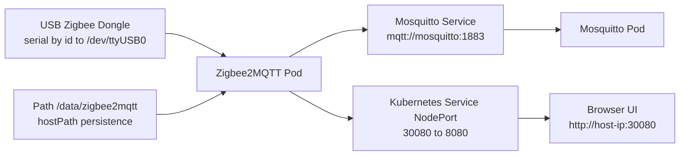

# Zigbee2MQTT auf Kubernetes mit Terraform

Sprache:

- Englisch: [README.md](README.md)
- Deutsch: diese Datei

## Eigentumer

- Name: Gulliversoft
- GitHub: https://github.com/gulliversoft
- Website: https://www.gulliversoft.com/

Dieses Projekt deployed Zigbee2MQTT auf Kubernetes (Minikube) mit Infrastructure as Code (Terraform), inklusive:

- Zigbee2MQTT Deployment
- USB-Dongle-Passthrough (`/dev/serial/by-id/...` -> `/dev/ttyUSB0`)
- MQTT-Broker (Mosquitto) im Cluster
- NodePort Service fur Web-UI Zugriff
- Persistentes Host-Datenverzeichnis (`/data/zigbee2mqtt`)

## Warum dieser IaC-Ansatz statt nur Docker

Die offizielle Zigbee2MQTT Docker-Anleitung ist sehr gut fur den direkten Container-Betrieb:

- https://www.zigbee2mqtt.io/guide/installation/02_docker.html#running-the-container

Dieses Setup nutzt Terraform + Kubernetes, weil es bietet:

- Reproduzierbarkeit: komplette Umgebung deklarativ in `main.tf`
- Versionierbare Infrastruktur: Anderungen reviewbar in Git
- Sicherere Ablaufe: vorhersagbarer `plan`/`apply` Workflow
- Team-Ubergabe: keine versteckten manuellen Runtime-Flags

Kurz: Docker ist einfach fur den schnellen Start, Terraform/Kubernetes ist starker fur wiederholbare Ablaufe und Lifecycle-Management.

## Warum nicht der Minikube Docker-Treiber

Fur USB-Zigbee-Adapter ist Hardwarezugriff der kritische Punkt.

Wenn Minikube mit dem Docker-Treiber lauft, lauft Kubernetes in einem containerisierten Node. In diesem Modus ist Host-USB-Passthrough oft unzuverlassig/begrenzt und kann Probleme verursachen wie:

- Geratepfad im Node nicht sichtbar
- Mount-Typ-Konflikte (`CharDevice` Fehler)
- Berechtigungs- und Namespace-Zugriffsprobleme

Ein Host-naher Kubernetes-Runtime-Ansatz (statt Docker-Treiber) gibt direkteren und stabileren Zugriff auf serielle Hardware (`/dev/ttyUSB0`, `/dev/serial/by-id/...`).

## Personliche Setup-Story (Blog-Style)

Ich habe die offizielle Zigbee2MQTT-Dokumentation als Inspirationsanker genutzt:

- https://www.zigbee2mqtt.io/guide/installation/02_docker.html#running-the-container

Sie war ein guter Startpunkt, aber mein Weg war deutlich holpriger als gedacht.

Am Anfang war ich uberzeugt, dass ich den USB-Dongle schnell in Minikube gemappt bekomme. Genau da kam die Enttauschung: Ich bin einer falschen Spur gefolgt, weil ich mich zu fruh auf einen statischen TTY-Pfad festgelegt habe. In meinem Kopf war "TTY0" die richtige Richtung. In der Praxis war das fur mein Setup zu ungenau und am Ende schlicht falsch.

Nach zwei Anlaufen habe ich das blinde Probieren beendet, die Logs gelesen und das eigentliche Problem verstanden: Das Gerat tauchte in der erwarteten USB-/Serial-Liste nicht stabil und nutzbar fur den Cluster auf.

Die entscheidenden Enumerations-Befehle waren:

```bash
lsusb
ls -la /dev/serial/by-id/
ls -la /dev/serial/by-id/ | grep -i itead
ls -la /dev/ttyUSB0
ls -la /dev/serial/by-id/*zstack*
```

Damit war klar: Nicht YAML war mein Hauptproblem, sondern Verfugbarkeit und Sichtbarkeit des richtigen Device-Pfads uber Host- und Runtime-Ebenen hinweg.

### Warum die offizielle device-Zeile mich zuerst irritiert hat

Die Zeile aus der offiziellen Doku ist technisch korrekt:

`--device=/dev/serial/by-id/usb-...-if00:/dev/ttyACM0`

Bedeutung:

- Linke Seite (vor `:`): Host-Pfad. Dieser Pfad muss auf dem Host real und stabil existieren.
- Rechte Seite (nach `:`): Container-Pfad. Das ist nur der Name, unter dem das Geraet im Container sichtbar wird.

Praktische Konsequenz:

- Der Container-Name (`/dev/ttyACM0`) ist nur ein Mapping-Ziel.
- Er ist kein Beweis, dass der Host exakt denselben Namen bereitstellt.
- Der stabile Anker ist immer der Host-Symlink unter `/dev/serial/by-id/...`.

Mein Fehler mit "TTY0 im Kopf" war, eine generische TTY-Idee als Quelle der Wahrheit zu behandeln. Die Wahrheit kommt zuerst aus der Host-Enumeration (`lsusb`, `/dev/serial/by-id/`) und danach aus dem Mapping in den Container.

### Warum es "Leftovers" gab

Die sogenannten Leftovers kamen nicht aus Unordnung, sondern aus einem typischen Wechsel im Losungsweg:

- zuerst Docker-Treiber getestet,
- dann auf `--driver=none` mit `containerd` gewechselt,
- dazwischen mehrfach neu gestartet, geloscht und neu initialisiert.

Dadurch blieben altere Artefakte und Dienste sichtbar (z. B. ein aktiver Docker-Snap-Dienst), obwohl sie fur den finalen No-Docker-Pfad nicht mehr gebraucht wurden. Technisch normal, in der Ruckschau aber verwirrend.

### Wer ist systemlord

`systemlord` ist der lokale Linux-Benutzer auf dieser Maschine. Das ist setupspezifischer Kontext und keine Anwendungsrolle.

- Ownership-Beispiele wie `/home/systemlord`, `~/.kube` und `~/.minikube` beziehen sich auf diesen Host-User.
- Die Berechtigungs-Fix-Befehle in dieser README stellen Besitzrechte nach privilegierten Operationen auf diesen lokalen Benutzer zuruck.

### Meine Hardware im Kontext

Meine aktuelle Maschine lauft auf:

- Architektur: `x86_64` (64-bit-fahig, Little Endian)
- CPU: `Intel Atom x6416RE @ 1.70GHz`
- Kerne: `4` (ohne Hyper-Threading, 1 Thread pro Kern)

Das ist keine High-End-Workstation. Genau deshalb war die Trennung der Fehlerbilder wichtig: USB-Mapping, Runtime/Berechtigungen und Cluster-Rollout mussten getrennt verifiziert werden.

### Der zweite MQTT-Container: Warum uberhaupt?

Ein weiteres Frustthema war MQTT. In der offiziellen Doku ist nicht sofort offensichtlich, dass in vielen realen Setups ein separater Broker notig ist, wenn keiner vorhanden ist.

Ich musste einen zweiten Container (Mosquitto) nachrusten, weil Zigbee2MQTT ohne erreichbaren Broker nicht stabil startet. Erst mit einem expliziten Broker-Service wurde das Verhalten reproduzierbar.

### Warum nicht als Sidecar?

Ich habe die Sidecar-Idee bewusst verworfen und Broker + Zigbee2MQTT getrennt betrieben. Grunde:

- Klarere Verantwortungen: Messaging-Dienst und Gerate-Bridge sind getrennte Rollen.
- Bessere Wiederverwendung: Der Broker kann auch von weiteren Workloads genutzt werden.
- Unabhangiger Lifecycle: Broker-Neustart und Zigbee2MQTT-Neustart mussen nicht gekoppelt sein.
- Einfacheres Troubleshooting: Broker-Netzwerk/Auth-Probleme sind klar von Zigbee-Serial-Problemen getrennt.

Ruckblickend war genau diese Trennung der Punkt, der das Setup wartbar gemacht hat.

## Ubuntu 24.04.3 LTS Installationsnotizen: Minikube ohne Docker-Treiber

Dieser Abschnitt dokumentiert den aktuellen Zustand der Maschine und rekonstruiert die Installationsschritte aus Shell-Historie und lokaler Konfiguration.

Wichtige Einschrankung:

- Die Shell-Historie enthalt keine zuverlassigen Zeitstempel. Die Reihenfolge unten ist daher aus Befehlsreihenfolge und Datei-Zeitstempeln auf dieser Maschine am 2026-10-03 rekonstruiert.

### Aktueller lokaler Zustand

| Komponente | Aktive Version | Aktiver Pfad | Hinweis |
|---|---|---|---|
| Linux-Distribution | Ubuntu 24.04.3 LTS | `/etc/os-release` | Aktuelles Basis-OS |
| Minikube | `v1.39.0` | `/usr/local/bin/minikube` | Manuell installierte Binary |
| kubectl | `v1.37.1` | `/usr/bin/kubectl` | Aktive Client-Version |
| Kubernetes API-Server | `v1.37.0` | Cluster-Runtime | Aktuelle Minikube-Cluster-Version |
| Terraform | `v1.16.5` | `/snap/bin/terraform` | Aktive Installation aus Snap |
| containerd | `2.2.1` | Systempaket | Runtime fur No-Docker-Setup |
| kubelet | `1.37.1` | Systempaket | Notig fur `--driver=none` |
| kubeadm | `1.37.1` | Systempaket | Cluster-Bootstrap Tooling |
| cri-tools | `1.37.0` | Systempaket | Runtime-Troubleshooting Tooling |

### Relevante Dienste auf dieser Maschine

| Dienst | Zustand | Warum relevant | Fur No-Docker Minikube notig |
|---|---|---|---|
| `containerd.service` | enabled | Container-Runtime fur den lokalen Cluster | Ja |
| `kubelet.service` | enabled | Fuhrt Kubernetes-Node-Komponenten aus | Ja |
| `snap.docker.dockerd.service` | enabled | Leftover aus fruheren Docker-Treiber-Versuchen | Nein |

### Rekonstruierte Installationsreihenfolge

Die folgende Reihenfolge ist aus der Command-History rekonstruierbar. Sie enthalt fruhere Docker-basierte Versuche und den spateren Wechsel auf No-Docker.

| Reihenfolge | Komponente / Schritt | In der History gefundene Befehle | Kommentar |
|---|---|---|---|
| 1 | Docker-Experiment | `sudo snap install docker` | Fruher Versuch mit Docker-Treiber, fur finales Setup nicht erforderlich |
| 2 | Terraform Installation | `sudo snap install terraform --classic` | Bis heute aktive Terraform-Installation |
| 3 | kubectl Installationsversuch | `sudo snap install kubectl --classic` | Fruher Versuch; aktive Binary ist jetzt APT-basiert |
| 4 | Minikube Download | `curl -LO https://github.com/kubernetes/minikube/releases/latest/download/minikube-linux-amd64` | Direkter Binary-Download |
| 5 | Minikube Installation | `sudo install minikube-linux-amd64 /usr/local/bin/minikube && rm minikube-linux-amd64` | Aktuelle aktive Minikube Binary |
| 6 | Wechsel weg vom Docker-Treiber | `sudo -E minikube start --driver=none` | Erste No-Docker Startversuche |
| 7 | Bereinigung fehlerhaften lokalen Zustands | `sudo minikube delete --all` und `rm -rf ~/.minikube ~/.kube/config` | Reset nach fehlgeschlagenen Versuchen |
| 8 | containerd Installation | `sudo apt-get install -y containerd` | Runtime fur finales Setup |
| 9 | containerd Konfigurationsverzeichnis | `sudo mkdir -p /etc/containerd` | Bereitet Runtime-Config-Pfad vor |
| 10 | containerd Default-Konfiguration | `sudo containerd config default | sudo tee /etc/containerd/config.toml` | Erzeugt Runtime-Konfiguration |
| 11 | containerd Neustart | `sudo systemctl restart containerd` | Aktiviert Runtime-Konfiguration |
| 12 | Minikube No-Docker Retry | `sudo -E minikube start --driver=none` | Erfolgreiches Muster fur den weiteren Betrieb |
| 13 | Ownership-Reparatur | `sudo chown -R $(id -u):$(id -g) ~/.kube ~/.minikube` | Behebt root-owned kube/minikube Dateien nach sudo-Start |
| 14 | Terraform Deployment | `terraform init`, `terraform plan`, `terraform apply -auto-approve` | Deployt den Zigbee2MQTT Stack |

### Download-URLs und curl-Befehle

#### Minikube

```bash
curl -LO https://github.com/kubernetes/minikube/releases/latest/download/minikube-linux-amd64
sudo install -o root -g root -m 0755 minikube-linux-amd64 /usr/local/bin/minikube
rm minikube-linux-amd64
```

#### kubectl passend zur aktuellen lokalen Cluster-Linie

Der aktuelle Cluster ist `v1.37.0` und der aktuelle Client ist `v1.37.1`. Das ist ein guter Match.

```bash
curl -LO "https://dl.k8s.io/release/v1.37.1/bin/linux/amd64/kubectl"
curl -LO "https://dl.k8s.io/release/v1.37.1/bin/linux/amd64/kubectl.sha256"
echo "$(cat kubectl.sha256)  kubectl" | sha256sum --check
chmod +x kubectl
sudo install -o root -g root -m 0755 kubectl /usr/local/bin/kubectl
rm kubectl kubectl.sha256
```

#### Terraform

Das aktive Terraform auf dieser Maschine ist `1.16.5`.

```bash
sudo apt-get update
sudo apt-get install -y unzip
curl -LO https://releases.hashicorp.com/terraform/1.16.5/terraform_1.16.5_linux_amd64.zip
unzip terraform_1.16.5_linux_amd64.zip
sudo install -o root -g root -m 0755 terraform /usr/local/bin/terraform
rm terraform terraform_1.16.5_linux_amd64.zip
```

### Kubernetes Repository Setup fur `kubelet`, `kubeadm`, `cri-tools`

Fur eine saubere Ubuntu 24.04 No-Docker-Installation sollten diese Pakete aus dem Kubernetes APT-Repository der `v1.37` Linie kommen.

```bash
sudo apt-get update
sudo apt-get install -y apt-transport-https ca-certificates curl gpg
sudo mkdir -p -m 0755 /etc/apt/keyrings
curl -fsSL https://pkgs.k8s.io/core:/stable:/v1.37/deb/Release.key | sudo gpg --dearmor -o /etc/apt/keyrings/kubernetes-apt-keyring.gpg
echo 'deb [signed-by=/etc/apt/keyrings/kubernetes-apt-keyring.gpg] https://pkgs.k8s.io/core:/stable:/v1.37/deb/ /' | sudo tee /etc/apt/sources.list.d/kubernetes.list
sudo apt-get update
sudo apt-get install -y kubelet kubeadm kubectl cri-tools conntrack containerd
sudo apt-mark hold kubelet kubeadm kubectl cri-tools
```

### End-to-End Installationsbefehle fur Minikube ohne Docker-Treiber

Das ist die saubere Befehlsfolge fur Ubuntu 24.04.3 LTS mit `containerd` statt Docker.

```bash
sudo apt-get update
sudo apt-get install -y apt-transport-https ca-certificates curl gpg unzip conntrack containerd

sudo mkdir -p -m 0755 /etc/apt/keyrings
curl -fsSL https://pkgs.k8s.io/core:/stable:/v1.37/deb/Release.key | sudo gpg --dearmor -o /etc/apt/keyrings/kubernetes-apt-keyring.gpg
echo 'deb [signed-by=/etc/apt/keyrings/kubernetes-apt-keyring.gpg] https://pkgs.k8s.io/core:/stable:/v1.37/deb/ /' | sudo tee /etc/apt/sources.list.d/kubernetes.list

sudo apt-get update
sudo apt-get install -y kubelet kubeadm kubectl cri-tools
sudo apt-mark hold kubelet kubeadm kubectl cri-tools

curl -LO https://github.com/kubernetes/minikube/releases/latest/download/minikube-linux-amd64
sudo install -o root -g root -m 0755 minikube-linux-amd64 /usr/local/bin/minikube
rm minikube-linux-amd64

curl -LO https://releases.hashicorp.com/terraform/1.16.5/terraform_1.16.5_linux_amd64.zip
unzip terraform_1.16.5_linux_amd64.zip
sudo install -o root -g root -m 0755 terraform /usr/local/bin/terraform
rm terraform terraform_1.16.5_linux_amd64.zip

sudo mkdir -p /etc/containerd
sudo containerd config default | sudo tee /etc/containerd/config.toml >/dev/null
sudo systemctl enable --now containerd
sudo systemctl enable --now kubelet

sudo -E minikube start --driver=none --container-runtime=containerd
sudo chown -R "$USER":"$USER" ~/.kube ~/.minikube
chmod 700 ~/.kube ~/.minikube
chmod 600 ~/.kube/config
```

### Berechtigungen und Ownership

Bei `--driver=none` braucht der Minikube-Start oft `sudo`. Dadurch bleiben haufig root-owned Dateien in `~/.kube` und `~/.minikube` zuruck.

Empfohlene Fix-Befehle:

```bash
sudo chown -R "$USER":"$USER" ~/.kube ~/.minikube
chmod 700 ~/.kube ~/.minikube
chmod 600 ~/.kube/config
find ~/.minikube -type f -name '*.key' -exec chmod 600 {} \;
```

Aktueller lokaler Zustand auf dieser Maschine:

- `~/.kube/config` ist bereits `600` und Eigentum von `systemlord`.
- `~/.kube` gehort `systemlord`.
- `~/.minikube` gehort `systemlord`.

### Cluster-Startverhalten in dieser Fassung

In dieser Setup-Fassung startet der Cluster-Stack nach Host-Boot automatisch, weil `containerd` und `kubelet` als Systemdienste aktiviert sind.

Vorher, mit dem Docker-Treiber-Ansatz, musste ich Minikube in der Praxis fast immer manuell starten (`minikube start --driver=docker`), bevor ich arbeiten konnte.

Praktischer Unterschied:

- Fruherer Ablauf: Shell offnen, Minikube manuell starten, dann deployen/arbeiten.
- Aktueller Ablauf: Dienste starten mit dem System, Cluster-Zustand ist im Alltag direkt verfugbar.

### Befehle nach der Installation

```bash
terraform init
terraform plan
terraform apply -auto-approve
kubectl get pods -A
kubectl get pods -n garden -o wide
kubectl get svc -n garden
kubectl logs -n garden -l app=plantApp --tail=200
kubectl port-forward -n garden svc/terraformed-garden-plant-svc 8080:8080
```

## Architektur



## Laufzeitverhalten

1. Zigbee2MQTT startet und liest die Konfiguration aus `/app/data`.
2. Der USB-Adapter wird auf `/dev/ttyUSB0` erkannt (zstack).
3. Der Zigbee-Stack initialisiert (`zigbee-herdsman started`).
4. Zigbee2MQTT verbindet sich mit MQTT (`mqtt://mosquitto:1883`).
5. Das Frontend lauft intern auf Port `8080`.
6. Kubernetes NodePort exponiert die UI auf `30080`.

Erwartete Healthy-Log-Sequenz:

- `Matched adapter ... => zstack`
- `Serialport opened`
- `Connected to MQTT server`
- `Zigbee2MQTT started!`

## Zugriff

- UI: `http://<host-ip>:30080`
- Interner Service: `terraformed-garden-plant-svc.garden.svc.cluster.local:8080`

## UI Ansichten

### UI Ansicht 1


### UI Ansicht 2


## Deploy-Befehle

```bash
terraform validate
terraform plan
terraform apply -auto-approve
```

## kubectl Befehlsreferenz

| Befehl | Bedeutung | Wofur | Wann nutzen |
|---|---|---|---|
| `kubectl port-forward -n garden svc/terraformed-garden-plant-svc 8080:8080` | Erstellt einen lokalen Tunnel von deiner Maschine auf Port `8080` des Kubernetes-Service im Namespace `garden`. | Lokaler Zugriff auf die Zigbee2MQTT Web-UI ohne NodePort oder externes Routing. | Wenn du schnellen lokalen Browserzugriff fur Tests, Debugging oder UI-Checks brauchst. |
| `kubectl get pods -n garden -o wide` | Listet alle Pods im Namespace `garden` mit erweiterten Details wie Node, Pod-IP und Status. | Prufen, ob Anwendungspods laufen, restarten, pending sind oder auf dem erwarteten Node liegen. | Als erster Check bei Deployment- oder Laufzeitproblemen. |
| `kubectl get svc -n garden` | Listet alle Services im Namespace `garden`. | Prufen, ob der Service existiert, welche Ports freigegeben sind und ob das Service-Routing stimmt. | Wenn UI-Zugriff fehlschlagt oder du Service-Name/Ports verifizieren willst. |
| `kubectl logs -n garden -l app=plantApp --tail=20` | Zeigt die letzten `20` Log-Zeilen von Pods mit Label `app=plantApp`. | Schneller Health-Snapshot mit wenig Output. | Fur Kurzcheck nach Deployment, Restart oder Konfigurationsanderungen. |
| `kubectl logs -n garden -l app=plantApp --tail=200` | Zeigt die letzten `200` Log-Zeilen von Pods mit Label `app=plantApp`. | Mehr Start-Historie und Laufzeitdetails, inkl. MQTT-Verbindung und Zigbee-Adapter-Initialisierung. | Wenn die kurze Log-Ansicht nicht ausreicht, um einen Fehler zu verstehen. |
| `kubectl describe pod -n garden -l app=plantApp \| grep -A20 "Events:"` | Beschreibt passende Pods und filtert auf den `Events`-Abschnitt plus die nachsten `20` Zeilen. | Kubernetes-seitige Probleme erkennen: Image-Pull-Fehler, Scheduling-Probleme, Mount-Fehler oder Restart-Ursachen. | Wenn Pods nicht korrekt starten, dauernd restarten oder im Pending bleiben. |
| `kubectl rollout restart deployment terraformed-garden-plant -n garden` | Triggert einen Rolling Restart des Deployments im Namespace `garden`. | Anwendungspods neu starten ohne Deployment manuell zu loschen. | Nach Config/Secret/Env-Anderungen oder wenn die App festhangt. |
| `kubectl rollout status deployment terraformed-garden-plant -n garden --timeout=180s` | Wartet auf Abschluss des Deployment-Rollouts mit Timeout `180` Sekunden. | Bestatigen, dass Restart/Update wieder healthy ist. | Direkt nach `rollout restart` oder nach Deployment-Anderungen. |

Hinweise:

- `-n garden` bedeutet, der Befehl lauft im Namespace `garden`.
- `-l app=plantApp` selektiert nur Ressourcen mit Label `app=plantApp`.
- Fur `rollout status` ist das korrekte Flag `--timeout=180s`.

## Troubleshooting Kurznotizen

- Wenn Onboarding wiederholt erscheint, persistierte Config in `/data/zigbee2mqtt/configuration.yaml` prufen.
- Wenn UI auf `localhost:8080` umleitet, NodePort-URL direkt aufrufen.
- Wenn der Start bei MQTT-Verbindung scheitert, Mosquitto Service/Pod prufen.
- Wenn USB nicht geoffnet werden kann (`Operation not permitted`), Device-Mount-Pfad und Container-Berechtigungen erneut prufen.

## FAQ

### Warum hat `--device=/dev/serial/by-id/...:/dev/ttyACM0` zwei verschiedene Pfade?

- Der Pfad vor `:` ist der Host-Pfad und muss auf dem Host existieren.
- Der Pfad nach `:` ist nur der Pfadname im Container.
- Immer zuerst die Host-Enumeration verifizieren (`lsusb`, `/dev/serial/by-id/`) und danach in den Container mappen.

### Was ist `systemlord` in dieser Dokumentation?

- `systemlord` ist der lokale Linux-Benutzer auf genau dieser Maschine.
- Das ist setupspezifischer Kontext fur Ownership-/Berechtigungsbeispiele, keine Anwendungsrolle.

### Warum gibt es Docker-Leftovers, obwohl dieses Setup ohne Docker-Treiber lauft?

- Die Leftovers stammen aus fruheren Versuchen mit Docker-Treiber, bevor auf `--driver=none` und `containerd` gewechselt wurde.
- Alte Dienste oder Artefakte nach so einer Migration sind normal, solange sie nicht aktiv genutzt werden.

### Startet der Cluster jetzt automatisch?

- In dieser Fassung ja: `containerd` und `kubelet` sind als Systemdienste aktiviert.
- Beim fruheren Docker-Treiber-Ansatz war meist ein manueller Start notig (`minikube start --driver=docker`).

## Verwandte Projekte von Gulliversoft

Offentliche Repositories aus dem GitHub-Profil (Uberblick):

- IAC-zigbee2mqtt
    Infrastructure as Code Projekt rund um Zigbee2MQTT Deployment-Muster.
    https://github.com/gulliversoft/IAC-zigbee2mqtt
- helmfactory
    Kubernetes Packaging mit Helm und Templating.
    https://github.com/gulliversoft/helmfactory
- Deploy-to-k8s
    Demo-Falle fur Terraform-basierte Kubernetes Deployment-Techniken.
    https://github.com/gulliversoft/Deploy-to-k8s
- am65x
    C-Bibliothek fur Low-Level Hardwarezugriff.
    https://github.com/gulliversoft/am65x
- Deploy-to-AKS
    Azure DevOps nach AKS Deployment Showcase (Fork).
    https://github.com/gulliversoft/Deploy-to-AKS
- betaflight
    Firmware-Customizing fur DroneID-nahe Flug-Use-Cases (Fork).
    https://github.com/gulliversoft/betaflight
- DroneID
    Linux-Transmitter-Projekt fur Bluetooth- und Wi-Fi-Drone-ID (Fork).
    https://github.com/gulliversoft/DroneID
- gpsd
    Gespiegelte/Fork-Variante der GPS-Daemon-Codebasis.
    https://github.com/gulliversoft/gpsd
- Optomat
    C++ Projekt.
    https://github.com/gulliversoft/Optomat
- ep3-bs
    Online-Buchungssystem fur Platze (Fork).
    https://github.com/gulliversoft/ep3-bs
- node-red-contrib-rfid-nfc
    Node-RED Integration fur NXP PN532 RFID/NFC.
    https://github.com/gulliversoft/node-red-contrib-rfid-nfc

Profil-Referenz:

- https://github.com/gulliversoft?tab=repositories
