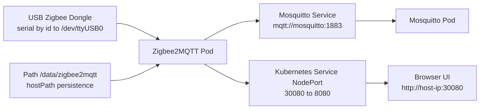
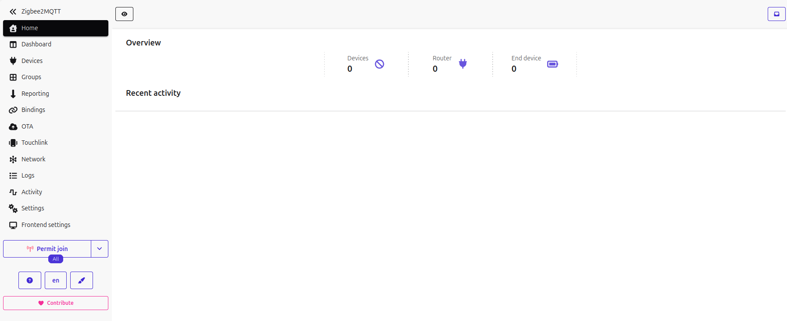
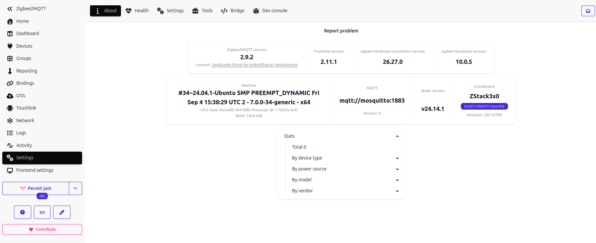

# Zigbee2MQTT on Kubernetes with Terraform

Language:

- English: this file
- German: [README.de.md](README.de.md)

## Owner

- Name: Gulliversoft
- GitHub: https://github.com/gulliversoft
- Website: https://www.gulliversoft.com/

This project deploys Zigbee2MQTT to Kubernetes (Minikube) using Infrastructure as Code (Terraform), including:

- Zigbee2MQTT deployment
- USB dongle passthrough (`/dev/serial/by-id/...` -> `/dev/ttyUSB0`)
- MQTT broker (Mosquitto) in-cluster
- NodePort service for web UI access
- Persistent host data directory (`/data/zigbee2mqtt`)

## Why This Approach (IaC) Instead of Plain Docker

The official Zigbee2MQTT Docker guide is great for direct container usage:

- https://www.zigbee2mqtt.io/guide/installation/02_docker.html#running-the-container

This setup uses Terraform + Kubernetes because it provides:

- Reproducibility: full environment is declarative in `main.tf`
- Versionable infrastructure: reviewable changes in Git
- Safer operations: predictable `plan`/`apply` workflow
- Team handover: no hidden manual runtime flags

In short: plain Docker is simple for quick starts, while Terraform/Kubernetes is stronger for repeatable operations and lifecycle management.

## Why Not Minikube Docker Driver for This Use Case

For USB Zigbee adapters, hardware access is the critical requirement.

When Minikube runs with the Docker driver, Kubernetes runs inside a containerized node. In that mode, host USB device passthrough is unreliable/limited and can cause issues such as:

- device path not visible inside node
- mount type mismatches (`CharDevice` errors)
- permission and namespace access problems

Using a host-level Kubernetes runtime (instead of Docker driver) provides more direct and stable access to serial hardware (`/dev/ttyUSB0`, `/dev/serial/by-id/...`).

## Personal Setup Story (Blog-Style)

I used the official Zigbee2MQTT documentation as my anchor:

- https://www.zigbee2mqtt.io/guide/installation/02_docker.html#running-the-container

It was a great starting point, but my path was rougher than expected.

At first I was convinced I could map the USB dongle into Minikube quickly. That was the disappointment: I followed the wrong trail because I locked onto a static TTY path too early. In my head, "TTY0" was the direction to chase. In practice, that was too vague and simply the wrong guidepost for my setup.

After two attempts, I stopped guessing, checked the logs, and understood the real issue: the device was not appearing in the expected USB/serial list in a stable and usable way for the cluster.

The key enumeration commands were:

```bash
lsusb
ls -la /dev/serial/by-id/
ls -la /dev/serial/by-id/ | grep -i itead
ls -la /dev/ttyUSB0
ls -la /dev/serial/by-id/*zstack*
```

That made one thing obvious: YAML was not my main problem. Device path availability and visibility across host and runtime layers was.

### Why The Official device Mapping Line Was Misleading At First

The official guide line is technically correct:

`--device=/dev/serial/by-id/usb-...-if00:/dev/ttyACM0`

Interpretation:

- Left side (before `:`): host path. This must be a real and stable device path on the host.
- Right side (after `:`): container path. This is the name seen inside the container.

What this means in practice:

- The container-side name (`/dev/ttyACM0`) is only a mapping target.
- It is not proof that the host exposes that exact same name.
- The safe anchor is always the host symlink under `/dev/serial/by-id/...`.

My "TTY0 in my head" mistake came from treating a generic TTY idea as the source of truth. The source of truth is host enumeration (`lsusb`, `/dev/serial/by-id/`), then mapping from that path into the container.

### Why There Were "Leftovers"

The so-called leftovers were not caused by chaos. They came from a typical shift in approach:

- first trying the Docker driver,
- then moving to `--driver=none` with `containerd`,
- restarting, deleting, and re-initializing several times in between.

This left older artifacts and services visible (for example, an active Docker Snap service), even though they were no longer needed for the final no-Docker path. Technically normal, but confusing when you only look at the final state.

### Who Is systemlord

`systemlord` is the local Linux user account on this machine. It is setup-specific context, not an application role.

- Ownership examples like `/home/systemlord`, `~/.kube`, and `~/.minikube` refer to this host user.
- Permission-fix commands in this README are written to restore ownership back to that local user after privileged operations.

### My Hardware in Context

My current machine runs on:

- Architecture: `x86_64` (64-bit capable, little-endian)
- CPU: `Intel Atom x6416RE @ 1.70GHz`
- Cores: `4` (no hyper-threading, 1 thread per core)

This is not a high-end workstation. That is exactly why separating failure domains mattered: USB mapping, runtime/permissions, and cluster rollout all had to be verified independently.

### The Second MQTT Container: Why At All?

Another source of frustration was MQTT. The official docs do not make it immediately obvious that many real setups need a separate broker when none already exists.

I had to add a second container (Mosquitto), because Zigbee2MQTT does not start reliably without a reachable broker. Only with an explicit broker service did behavior become reproducible.

### Why Not As a Sidecar?

I intentionally rejected the sidecar approach and kept broker + Zigbee2MQTT separate. Reasons:

- Clear ownership boundaries: messaging service and device bridge are separate roles.
- Better reuse: the broker can be shared by future workloads.
- Independent lifecycle: broker restarts and Zigbee2MQTT restarts do not need to be coupled.
- Easier troubleshooting: broker network/auth issues stay clearly separated from Zigbee serial issues.

Looking back, that separation is what made the setup maintainable.

## Ubuntu 24.04.3 LTS Install Notes: Minikube Without Docker Driver

This section documents the current machine state and reconstructs the installation steps from shell history and local config state.

Important limitation:

- The shell history does not contain reliable timestamps, so the sequence below is reconstructed from command order and file timestamps from this machine on 2026-10-03.

### Current Local State

| Component | Active version | Active path | Notes |
|---|---|---|---|
| Linux distribution | Ubuntu 24.04.3 LTS | `/etc/os-release` | Current machine base OS |
| Minikube | `v1.39.0` | `/usr/local/bin/minikube` | Manually installed binary |
| kubectl | `v1.37.1` | `/usr/bin/kubectl` | Active client version |
| Kubernetes API server | `v1.37.0` | cluster runtime | Current Minikube cluster version |
| Terraform | `v1.16.5` | `/snap/bin/terraform` | Active install is from Snap |
| containerd | `2.2.1` | system package | Runtime used for no-Docker setup |
| kubelet | `1.37.1` | system package | Required for `--driver=none` |
| kubeadm | `1.37.1` | system package | Cluster bootstrap tooling |
| cri-tools | `1.37.0` | system package | Runtime troubleshooting tooling |

### Relevant Services On This Machine

| Service | State | Why it matters | Needed for no-Docker Minikube |
|---|---|---|---|
| `containerd.service` | enabled | Container runtime for the local cluster | Yes |
| `kubelet.service` | enabled | Runs Kubernetes node components | Yes |
| `snap.docker.dockerd.service` | enabled | Leftover from earlier Docker-driver attempts | No |

### Reconstructed Installation Sequence

The following sequence is what can be reconstructed from the command history. It includes both earlier Docker-based attempts and the later switch to the no-Docker setup.

| Order | Component / step | Commands seen in history | Comment |
|---|---|---|---|
| 1 | Docker experiment | `sudo snap install docker` | Earlier attempt with Docker driver, not required for final setup |
| 2 | Terraform install | `sudo snap install terraform --classic` | Still the active Terraform installation |
| 3 | kubectl install attempt | `sudo snap install kubectl --classic` | Earlier attempt; active binary is now APT-based |
| 4 | Minikube download | `curl -LO https://github.com/kubernetes/minikube/releases/latest/download/minikube-linux-amd64` | Direct binary download |
| 5 | Minikube install | `sudo install minikube-linux-amd64 /usr/local/bin/minikube && rm minikube-linux-amd64` | Current active Minikube binary |
| 6 | Switch away from Docker driver | `sudo -E minikube start --driver=none` | First no-Docker startup attempts |
| 7 | Cleanup of broken local state | `sudo minikube delete --all` and `rm -rf ~/.minikube ~/.kube/config` | Reset after failed attempts |
| 8 | containerd install | `sudo apt-get install -y containerd` | Runtime for the final setup |
| 9 | containerd config directory | `sudo mkdir -p /etc/containerd` | Prepares runtime config path |
| 10 | containerd default config | `sudo containerd config default | sudo tee /etc/containerd/config.toml` | Generates runtime config |
| 11 | containerd restart | `sudo systemctl restart containerd` | Activates runtime config |
| 12 | Minikube no-Docker retry | `sudo -E minikube start --driver=none` | Successful pattern used later |
| 13 | Ownership repair | `sudo chown -R $(id -u):$(id -g) ~/.kube ~/.minikube` | Fixes root-owned kube/minikube files after sudo start |
| 14 | Terraform deployment | `terraform init`, `terraform plan`, `terraform apply -auto-approve` | Deploys the Zigbee2MQTT stack |

### Download URLs and curl Commands

#### Minikube

```bash
curl -LO https://github.com/kubernetes/minikube/releases/latest/download/minikube-linux-amd64
sudo install -o root -g root -m 0755 minikube-linux-amd64 /usr/local/bin/minikube
rm minikube-linux-amd64
```

#### kubectl matching the current local cluster line

The current cluster is `v1.37.0` and the current client is `v1.37.1`, which is a good match.

```bash
curl -LO "https://dl.k8s.io/release/v1.37.1/bin/linux/amd64/kubectl"
curl -LO "https://dl.k8s.io/release/v1.37.1/bin/linux/amd64/kubectl.sha256"
echo "$(cat kubectl.sha256)  kubectl" | sha256sum --check
chmod +x kubectl
sudo install -o root -g root -m 0755 kubectl /usr/local/bin/kubectl
rm kubectl kubectl.sha256
```

#### Terraform

The active Terraform on this machine is `1.16.5`.

```bash
sudo apt-get update
sudo apt-get install -y unzip
curl -LO https://releases.hashicorp.com/terraform/1.16.5/terraform_1.16.5_linux_amd64.zip
unzip terraform_1.16.5_linux_amd64.zip
sudo install -o root -g root -m 0755 terraform /usr/local/bin/terraform
rm terraform terraform_1.16.5_linux_amd64.zip
```

### Kubernetes Repository Setup For `kubelet`, `kubeadm`, `cri-tools`

For a clean Ubuntu 24.04 no-Docker installation, these packages should come from the Kubernetes APT repository matching the `v1.37` line.

```bash
sudo apt-get update
sudo apt-get install -y apt-transport-https ca-certificates curl gpg
sudo mkdir -p -m 0755 /etc/apt/keyrings
curl -fsSL https://pkgs.k8s.io/core:/stable:/v1.37/deb/Release.key | sudo gpg --dearmor -o /etc/apt/keyrings/kubernetes-apt-keyring.gpg
echo 'deb [signed-by=/etc/apt/keyrings/kubernetes-apt-keyring.gpg] https://pkgs.k8s.io/core:/stable:/v1.37/deb/ /' | sudo tee /etc/apt/sources.list.d/kubernetes.list
sudo apt-get update
sudo apt-get install -y kubelet kubeadm kubectl cri-tools conntrack containerd
sudo apt-mark hold kubelet kubeadm kubectl cri-tools
```

### End-to-End Installation Commands For Minikube Without Docker Driver

This is the clean command sequence for Ubuntu 24.04.3 LTS using `containerd` instead of Docker.

```bash
sudo apt-get update
sudo apt-get install -y apt-transport-https ca-certificates curl gpg unzip conntrack containerd

sudo mkdir -p -m 0755 /etc/apt/keyrings
curl -fsSL https://pkgs.k8s.io/core:/stable:/v1.37/deb/Release.key | sudo gpg --dearmor -o /etc/apt/keyrings/kubernetes-apt-keyring.gpg
echo 'deb [signed-by=/etc/apt/keyrings/kubernetes-apt-keyring.gpg] https://pkgs.k8s.io/core:/stable:/v1.37/deb/ /' | sudo tee /etc/apt/sources.list.d/kubernetes.list

sudo apt-get update
sudo apt-get install -y kubelet kubeadm kubectl cri-tools
sudo apt-mark hold kubelet kubeadm kubectl cri-tools

curl -LO https://github.com/kubernetes/minikube/releases/latest/download/minikube-linux-amd64
sudo install -o root -g root -m 0755 minikube-linux-amd64 /usr/local/bin/minikube
rm minikube-linux-amd64

curl -LO https://releases.hashicorp.com/terraform/1.16.5/terraform_1.16.5_linux_amd64.zip
unzip terraform_1.16.5_linux_amd64.zip
sudo install -o root -g root -m 0755 terraform /usr/local/bin/terraform
rm terraform terraform_1.16.5_linux_amd64.zip

sudo mkdir -p /etc/containerd
sudo containerd config default | sudo tee /etc/containerd/config.toml >/dev/null
sudo systemctl enable --now containerd
sudo systemctl enable --now kubelet

sudo -E minikube start --driver=none --container-runtime=containerd
sudo chown -R "$USER":"$USER" ~/.kube ~/.minikube
chmod 700 ~/.kube ~/.minikube
chmod 600 ~/.kube/config
```

### Permissions and Ownership

For `--driver=none`, Minikube startup often needs `sudo`. That commonly leaves root-owned files behind in `~/.kube` and `~/.minikube`.

Recommended fix commands:

```bash
sudo chown -R "$USER":"$USER" ~/.kube ~/.minikube
chmod 700 ~/.kube ~/.minikube
chmod 600 ~/.kube/config
find ~/.minikube -type f -name '*.key' -exec chmod 600 {} \;
```

Current local state observed on this machine:

- `~/.kube/config` is already `600` and owned by `systemlord`.
- `~/.kube` is owned by `systemlord`.
- `~/.minikube` is owned by `systemlord`.

### Cluster Startup Behavior In This Revision

In this setup revision, the cluster stack comes up automatically after host boot because `containerd` and `kubelet` are enabled as system services.

Before this revision, with the Docker-driver approach, I usually had to start Minikube manually (`minikube start --driver=docker`) whenever I wanted to use the cluster.

Practical difference:

- Earlier flow: open shell, start Minikube manually, then deploy/work.
- Current flow: services come up with the system, and cluster state is already available in normal daily use.

### Commands Used After Installation

```bash
terraform init
terraform plan
terraform apply -auto-approve
kubectl get pods -A
kubectl get pods -n garden -o wide
kubectl get svc -n garden
kubectl logs -n garden -l app=plantApp --tail=200
kubectl port-forward -n garden svc/terraformed-garden-plant-svc 8080:8080
```

## Architecture



## Runtime Behavior

1. Zigbee2MQTT starts and reads config from `/app/data`.
2. The USB adapter is discovered on `/dev/ttyUSB0` (zstack).
3. Zigbee stack initializes (`zigbee-herdsman started`).
4. Zigbee2MQTT connects to MQTT (`mqtt://mosquitto:1883`).
5. Frontend serves on internal port `8080`.
6. Kubernetes NodePort exposes UI at `30080`.

Expected healthy log sequence:

- `Matched adapter ... => zstack`
- `Serialport opened`
- `Connected to MQTT server`
- `Zigbee2MQTT started!`

## Access

- UI: `http://<host-ip>:30080`
- Internal service: `terraformed-garden-plant-svc.garden.svc.cluster.local:8080`

## UI Views

### UI View 1



### UI View 2



## Deploy Commands

```bash
terraform validate
terraform plan
terraform apply -auto-approve
```

## kubectl Command Reference

| Command | Meaning | What it is for | When to use |
|---|---|---|---|
| `kubectl port-forward -n garden svc/terraformed-garden-plant-svc 8080:8080` | Creates a local tunnel from your machine to port `8080` of the Kubernetes service in namespace `garden`. | Access the Zigbee2MQTT web UI locally without using NodePort or external networking. | Use this when you want quick local browser access for testing, debugging, or verifying the app UI. |
| `kubectl get pods -n garden -o wide` | Lists all pods in namespace `garden` with extended details such as node, pod IP, and status. | Check whether the application pods are running, restarting, pending, or scheduled on the expected node. | Use this first when diagnosing deployment or runtime issues. |
| `kubectl get svc -n garden` | Lists all services in namespace `garden`. | Verify that the service exists, confirm exposed ports, and check cluster or NodePort networking configuration. | Use this when UI access fails or when you need to confirm the service name and ports. |
| `kubectl logs -n garden -l app=plantApp --tail=20` | Shows the last `20` log lines from pods matching label `app=plantApp`. | Get a quick health snapshot without too much output. | Use this for a fast check after deployment, restart, or configuration changes. |
| `kubectl logs -n garden -l app=plantApp --tail=200` | Shows the last `200` log lines from pods matching label `app=plantApp`. | Review more startup history and runtime details, including MQTT connection and Zigbee adapter initialization. | Use this when the short log view is not enough to understand a failure. |
| `kubectl describe pod -n garden -l app=plantApp \| grep -A20 "Events:"` | Describes matching pods and filters the output to the `Events` section plus the next `20` lines. | Inspect Kubernetes-level problems such as image pull failures, scheduling issues, mount errors, or restart causes. | Use this when pods do not start correctly, keep restarting, or remain pending. |
| `kubectl rollout restart deployment terraformed-garden-plant -n garden` | Triggers a rolling restart of the deployment in namespace `garden`. | Restart the application pods without deleting the deployment manually. | Use this after config, secret, or environment changes, or when the app is stuck and needs a clean restart. |
| `kubectl rollout status deployment terraformed-garden-plant -n garden --timeout=180s` | Waits for the deployment rollout to complete, with a timeout of `180` seconds. | Confirm that the restarted or updated deployment becomes healthy again. | Use this immediately after `rollout restart` or after applying deployment changes. |

Notes:

- `-n garden` means the command runs in the `garden` namespace.
- `-l app=plantApp` selects only resources with the label `app=plantApp`.
- For `rollout status`, the correct flag is `--timeout=180s`.

## Troubleshooting Quick Notes

- If onboarding appears repeatedly, check persisted config in `/data/zigbee2mqtt/configuration.yaml`.
- If UI redirects to `localhost:8080`, open NodePort URL directly.
- If startup fails at MQTT connection, verify Mosquitto service/pod is running.
- If USB cannot open (`Operation not permitted`), re-check device mount path and container permissions.

## FAQ

### Why does `--device=/dev/serial/by-id/...:/dev/ttyACM0` use two different paths?

- The path before `:` is the host path and must exist on the host.
- The path after `:` is only the in-container path name.
- Always trust host enumeration first (`lsusb`, `/dev/serial/by-id/`), then map into the container.

### What is `systemlord` in this documentation?

- `systemlord` is the local Linux user account on this specific machine.
- It is setup-specific context for ownership/permission examples, not an application role.

### Why are there Docker leftovers if this setup is no-Docker-driver?

- Leftovers come from earlier attempts with the Docker driver before switching to `--driver=none` and `containerd`.
- Seeing old services or artifacts is expected after migration unless explicitly cleaned up.

### Does the cluster start automatically now?

- In this revision, yes: `containerd` and `kubelet` are enabled as system services.
- Earlier Docker-driver usage usually required manual startup (`minikube start --driver=docker`).

## Related Projects by Gulliversoft

Public repositories from the GitHub profile (overview):

- IAC-zigbee2mqtt
    Infrastructure as Code project around Zigbee2MQTT deployment patterns.
    https://github.com/gulliversoft/IAC-zigbee2mqtt
- helmfactory
    Helm and templating focused Kubernetes packaging work.
    https://github.com/gulliversoft/helmfactory
- Deploy-to-k8s
    Demo cases for Terraform-based Kubernetes deployment techniques.
    https://github.com/gulliversoft/Deploy-to-k8s
- am65x
    Low-level hardware access C library.
    https://github.com/gulliversoft/am65x
- Deploy-to-AKS
    Azure DevOps to AKS deployment showcase (fork).
    https://github.com/gulliversoft/Deploy-to-AKS
- betaflight
    Firmware customization work for DroneID-related flying use cases (fork).
    https://github.com/gulliversoft/betaflight
- DroneID
    Linux transmitter project for Bluetooth and Wi-Fi Drone ID (fork).
    https://github.com/gulliversoft/DroneID
- gpsd
    Mirrored/forked GPS daemon codebase variant.
    https://github.com/gulliversoft/gpsd
- Optomat
    C++ project.
    https://github.com/gulliversoft/Optomat
- ep3-bs
    Online booking system for courts (fork).
    https://github.com/gulliversoft/ep3-bs
- node-red-contrib-rfid-nfc
    Node-RED integration for NXP PN532 RFID/NFC.
    https://github.com/gulliversoft/node-red-contrib-rfid-nfc

Profile reference:

- https://github.com/gulliversoft?tab=repositories
